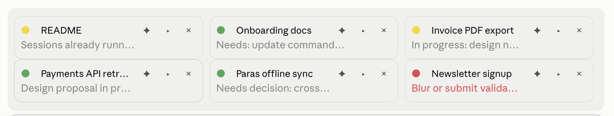

# playpen

**Who needs attention?** Your other Claude Code sessions as small cards above the prompt: a lamp for the state, a short label, what just happened, and one press to answer or jump there.


A [mod](https://code.claude.com/docs/en/plugins/mods/overview) for Claude Code, built on the plugin hooks the desktop app's Code tab and the terminal share. The name is the playpen: the sessions play on their own, and you look up when one of them calls. MIT, one file, nothing leaves your machine except the few words on each card.

## Why

Run four or five sessions at once and the question is always the same: *which one is waiting for me?* The sidebar says which sessions exist, not which one just asked something. playpen keeps the sessions you are actually working in in view, right where you type, and turns red when one of them needs you. You answer from where you are, or jump there.

## What you see



| | |
| :- | :- |
| **Lamp** | yellow while Claude works · green when the turn is done · **red when the session needs you** (a permission dialog or a question) · grey while the session rests (its process stopped) |
| **Label** | what the session is about, in a few words |
| **Gist** | the state of its latest reply, in a few words; red while a question is open |
| **✦** | hand the session off to a fresh one with a brief of its work (press twice: the first press arms it) |
| **►** | answer from here: the open question with its options, or the suggested next prompt with a send button. A permission dialog is the exception: see below |
| **×** | hide the card until you write in that session again, in every session's band |

A small model writes the label and gist in the language of the reply; each pair is written once and cached.

- **A card exists because you wrote in that session.** It appears at your first prompt there and stays until you press ×, archive the session, or newer sessions take its place. When the app stops an idle session's process, or you restart the app, or you come back the next morning, the card rests: grey, with its last summary, and wakes up when you open that session again. So the board always shows where you left off.
- **Click the label** to jump to that session.
- **Permission dialogs are answered in their own session.** A red card for a permission shows what it asks to run (`Bash: git push origin main`) and an **open session** button. Claude Code draws that dialog itself and lets no plugin answer it, since the answer authorises an action; playpen tells you where to go, and you approve or deny there. Questions (`AskUserQuestion`) are plain answers and can be given from any card.
- **Places belong to projects.** The first card from a folder takes the next free place; a later session in the same folder sits with it. Nothing moves when activity changes, and nothing moves under the pointer.
- **Three per row, two rows at most** by default: six sessions in two lines above the prompt. With three or fewer it is one line.
- `/board` collapses or expands the band.

## Install

From any Claude Code session:

```
/plugin marketplace add KytioisaCat/playpen
/plugin install playpen@kytioisacat
/reload-plugins
```

The install dialog asks for a few settings; the defaults are fine.

| Setting | Default | What it does |
| :- | :- | :- |
| Maximum cards | 6 | How many cards the band shows at most, three per row. |
| Short labels | on | Let a small model write the label and gist. Off, the card shows the title and the latest reply cut short. |
| Label model | `haiku` | Model alias or id for the labels. |
| Red after, in auto mode | 30 s | How long a call may wait for a permission in auto mode before the card turns red. See [Permissions in auto mode](#permissions-in-auto-mode). |

To try it without installing, clone the repository and start a session with `claude --plugin-dir /path/to/playpen`.

## Hand-off

When a session's context has grown long, press ✦ twice on its card. The session writes a brief of its work — the goal, what was done, the decisions and why, the state of the files, the open problems, the next steps — and saves it to `<project>/.claude/playpen/handoff-<stamp>-<title>.md`. The app's new-session page opens with a short opener filled in; the app creates the session when you send that prompt, so one Enter is yours. The new session's own playpen then gives the brief to the model as hidden context of that first prompt, moves the session to the project folder if the app opened it elsewhere (you approve the folder once), and keeps the old session's place in the sidebar: its pin and its custom group. The old card retires; the old session stays as it was.

**The model is the one thing it cannot carry.** The app starts every new session on the model last picked in its menu, whichever session asked for the hand-off, and nothing a session does from inside changes that choice or what the app shows. So when the two differ, playpen answers the first reply with the previous session's model and tells you, in a toast and a transcript line, to pick that model in the menu if you want to go on with it; otherwise the next messages use the app's choice. When the models are the same, nothing is said. This stays until the app lets a session be started on a model.

## Permissions in auto mode

In auto mode the app's classifier decides each permission itself, usually in a second or two, sometimes in ten or more, and only now and then leaves it to you as a dialog. A plugin is told that a call needs a permission and when the call is done, but not whether a dialog is up in between: the app keeps that to itself. So in auto mode playpen turns a card red when a call is waiting for a permission and the session has not moved for a set time, 30 seconds by default (*Red after, in auto mode*): no call has started or ended. Calls the classifier lets through one by one keep the session moving, so a queue stays yellow. That keeps the classifier's thinking from flashing cards red, at two prices: a real dialog shows red up to that long after it appeared, and a single approved command that runs longer than the wait (a long build, a big copy) looks the same as a dialog and may show red until it ends. In the other modes a permission is always a dialog, and the card turns red within a few seconds.

## Requirements and limits

- Claude Code 2.1.286 or later. The mod API is early access and may change between releases; a release that breaks the band gets a fix here.
- The desktop app gives the cards their titles and links and makes the jump work. In a plain terminal a card shows "Untitled session" and the jump copies a link.
- macOS for the jump (`open claude://…`); elsewhere the link is copied to the clipboard.
- The hand-off cannot choose the new session's model (above).
- A permission dialog cannot be answered from another session: playpen shows what it asks and takes you there.
- In auto mode a real permission dialog shows red only after the set wait (30 s by default), since the app does not tell plugins when its classifier hands a call to you.

## How it works

The mod runs in every session. Each session writes one JSON file about itself to `~/.claude/playpen/sessions/`: its title and link from the desktop app, its state from the mod's hooks (a tool call the engine put to a dialog, an `AskUserQuestion` with its options, the end of a turn), and the prompt suggestion. The hidden cards and the places on the board are one shared file, `~/.claude/playpen/board.json`, so every band shows the same board. Every session's band reads that folder every few seconds; a file whose heartbeat is older than 45 seconds counts as ended, so a crashed session disappears on its own.

Answering from another session appends the text to that session's inbox, `~/.claude/playpen/inbox/<id>.json`. The receiving mod reads its inbox every second, ends the turn that is waiting on the dialog, and submits the text as your own prompt. The hand-off goes the same way, with a marker the new session reads at start.

## Development

The plugin loads in place from a clone registered as a local marketplace (`claude plugin marketplace add /path/to/playpen`), so an edit to `hooks/register.tsx` takes effect at `/reload-plugins` or the next session. `claude plugin validate .` reads the marketplace file; to see what the hooks module hooks and calls, validate a copy without `.claude-plugin/marketplace.json`.

The engine writes its type declarations into `.claude-plugin/types/` the first time it loads the mod from this folder, and `tsconfig.json` extends them, so an editor or `npx tsc -p .` type-checks the module against the exact build you run.

## Ideas, not planned

Things that would fit the board and may come if someone wants them:

- A toast, and maybe a sound, when a card turns red or green, as an option off by default.
- Digit hotkeys to jump to a card's session from the keyboard.
- Tests under `claude plugin test`, and a listing in the Claude Directory.

## Privacy

Everything stays on your machine except the label and gist, which come from one small model call per changed card on your own Claude plan. The call sees the session title and the start of the latest reply. Treat that like any other text you send to Claude.

## License

MIT
